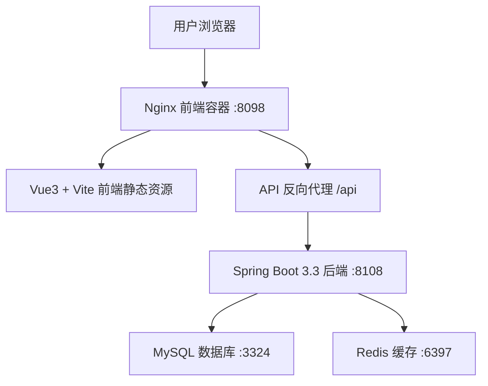
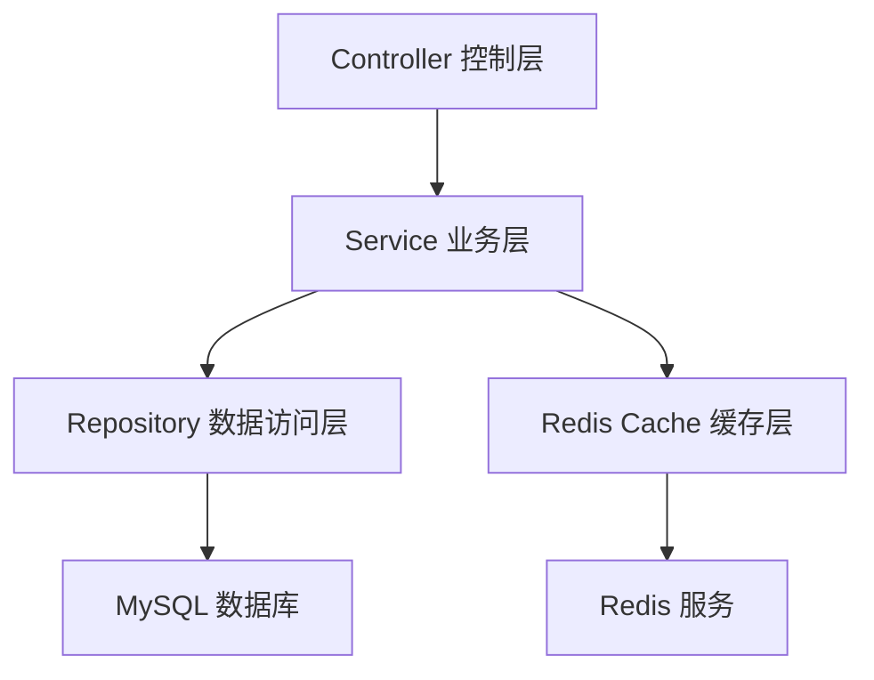
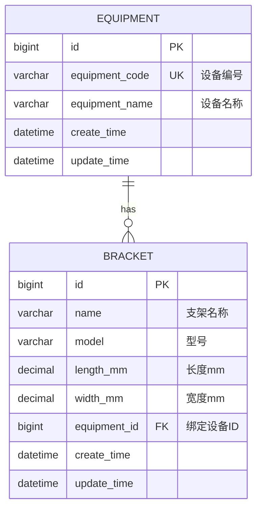

## 1. 架构设计



## 2. 技术说明

- **前端**：Vue 3 + Vite 5 + Vue Router 4 + Axios + Element Plus
- **前端镜像源**：华为云 npm 国内镜像 `https://mirrors.huaweicloud.com/repository/npm/`
- **后端**：Spring Boot 3.3 + JDK 17 + Spring Data JPA + Spring Data Redis
- **后端镜像源**：京东开源 Maven 镜像 `https://mirrors.jd.com/repository/public/`
- **数据库**：MySQL 8.0，关闭二进制日志，端口 3324
- **缓存**：Redis 7，采用 List 结构缓存常用支架型号清单，端口 6397
- **部署**：Docker Compose 全容器隔离部署

## 3. 路由定义

| 路由 | 用途 |
|------|------|
| / | 支架档案管理首页 |
| /equipment | 设备配套分页清单 |
| /batch-bind | 批量绑定页面 |

## 4. API 接口定义

### 4.1 支架档案接口

| 方法 | 路径 | 说明 |
|------|------|------|
| GET | /api/brackets | 分页查询支架列表（支持名称、型号关键词） |
| GET | /api/brackets/{id} | 查询单个支架详情 |
| POST | /api/brackets | 新增支架档案 |
| PUT | /api/brackets/{id} | 更新支架档案 |
| DELETE | /api/brackets/{id} | 删除支架档案（自动解绑） |
| GET | /api/brackets/models | 获取常用支架型号清单（Redis List 缓存） |

### 4.2 封口设备接口

| 方法 | 路径 | 说明 |
|------|------|------|
| GET | /api/equipments | 分页查询设备列表 |
| GET | /api/equipments/all | 查询所有设备（用于下拉选择） |
| GET | /api/equipment/{id}/brackets | 查询设备下所有绑定支架 |
| PUT | /api/equipment/{id}/rule | 保存设备配套规则（最大数量、允许型号、长宽范围） |
| POST | /api/equipment/{id}/rule/diagnose | 规则变更影响诊断（不落库）：预览受影响的已绑定支架，区分需人工处理的存量绑定与仅影响后续绑定的条目 |

### 4.3 绑定操作接口

| 方法 | 路径 | 说明 |
|------|------|------|
| POST | /api/bindings/{bracketId}/{equipmentId} | 单个支架绑定到设备 |
| DELETE | /api/bindings/{bracketId} | 单个支架解绑 |
| POST | /api/bindings/batch | 批量绑定：多支架绑定到同一设备 |

### 4.4 请求/响应结构

```typescript
// 支架实体
interface Bracket {
  id: number;
  name: string;
  model: string;
  lengthMm: number;
  widthMm: number;
  equipmentId: number | null;
  equipmentCode: string | null;
  createTime: string;
}

// 封口设备实体
interface Equipment {
  id: number;
  equipmentCode: string;
  equipmentName: string;
  bracketCount: number;
}

// 批量绑定请求
interface BatchBindRequest {
  bracketIds: number[];
  equipmentId: number;
}

// 通用分页响应
interface PageResponse<T> {
  content: T[];
  totalElements: number;
  totalPages: number;
  number: number;
  size: number;
}

// 通用响应
interface ApiResponse<T> {
  code: number;
  message: string;
  data: T;
}
```

## 5. 后端分层架构



- **Controller**：接收 HTTP 请求，参数校验，返回 JSON 响应
- **Service**：业务逻辑处理，绑定/解绑事务管理，缓存维护
- **Repository**：基于 Spring Data JPA 进行 CRUD 操作
- **Redis**：List 结构存储常用支架型号清单（key: `bracket:models:popular`）

## 6. 数据模型

### 6.1 ER 图



### 6.2 DDL 语句

```sql
-- 封口设备表
CREATE TABLE IF NOT EXISTS equipment (
    id BIGINT PRIMARY KEY AUTO_INCREMENT,
    equipment_code VARCHAR(50) NOT NULL UNIQUE COMMENT '封口机设备编号',
    equipment_name VARCHAR(100) COMMENT '设备名称',
    create_time DATETIME DEFAULT CURRENT_TIMESTAMP,
    update_time DATETIME DEFAULT CURRENT_TIMESTAMP ON UPDATE CURRENT_TIMESTAMP,
    INDEX idx_equipment_code (equipment_code)
) ENGINE=InnoDB DEFAULT CHARSET=utf8mb4 COMMENT='封口设备表';

-- 支架档案表
CREATE TABLE IF NOT EXISTS bracket (
    id BIGINT PRIMARY KEY AUTO_INCREMENT,
    name VARCHAR(100) NOT NULL COMMENT '支架名称',
    model VARCHAR(100) NOT NULL COMMENT '支架型号',
    length_mm DECIMAL(10,2) NOT NULL COMMENT '长度(mm)',
    width_mm DECIMAL(10,2) NOT NULL COMMENT '宽度(mm)',
    equipment_id BIGINT DEFAULT NULL COMMENT '绑定的封口设备ID',
    create_time DATETIME DEFAULT CURRENT_TIMESTAMP,
    update_time DATETIME DEFAULT CURRENT_TIMESTAMP ON UPDATE CURRENT_TIMESTAMP,
    INDEX idx_model (model),
    INDEX idx_equipment_id (equipment_id),
    CONSTRAINT fk_bracket_equipment FOREIGN KEY (equipment_id) REFERENCES equipment(id) ON DELETE SET NULL
) ENGINE=InnoDB DEFAULT CHARSET=utf8mb4 COMMENT='支架档案表';

-- 初始化封口设备测试数据
INSERT INTO equipment (equipment_code, equipment_name) VALUES
('FK-001', '1号封口机'),
('FK-002', '2号封口机'),
('FK-003', '3号封口机'),
('FK-004', '4号封口机'),
('FK-005', '5号封口机');
```

## 7. Docker 容器编排

| 容器名 | 镜像 | 端口映射 | 说明 |
|--------|------|----------|------|
| mysql-bracket | mysql:8.0 | 3324:3306 | 关闭 binlog，初始化表结构 |
| redis-bracket | redis:7-alpine | 6397:6379 | 缓存常用支架型号 |
| backend-bracket | 自定义 openjdk:17 镜像 | 8108:8108 | Spring Boot 服务 |
| frontend-bracket | 自定义 nginx:alpine 镜像 | 8098:80 | Vue3 静态资源 + API 反向代理 |
